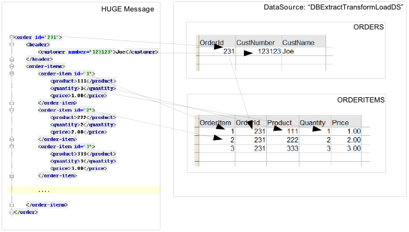

= Smooks Persistence Cartridge

image:https://img.shields.io/maven-central/v/org.smooks.cartridges.persistence/smooks-persistence-cartridge[Maven Central]
image:https://img.shields.io/nexus/s/org.smooks.cartridges/smooks-persistence-cartridge?server=https%3A%2F%2Foss.sonatype.org[Sonatype Nexus (Snapshots)]
image:https://github.com/smooks/smooks-persistence-cartridge/workflows/CI/badge.svg[Build Status]

// tag::smooks-persistence-cartridge[]
Smooks support for databases include:

* link:#jdbc[JDBC resources] to read from and write to the database using SQL.

* link:#persistence[Entity persistence resources] to leverage persistence frameworks such as MyBatis, Hibernate, or any JPA compatible framework.

* link:#data-access-objects[Data Access Object (DAO) resources] where CRUD methods are invoked to issue database reads and writes.

== JDBC

Consider an ETL scenario where order and order items needs to be saved to the database:

To route an order and order item data to a database, you should define a set of Java bindings that extract the _order_ and _order-item_ data from the input source stream:

[source,xml]
----
<?xml version="1.0"?>
<smooks-resource-list xmlns="https://www.smooks.org/xsd/smooks-2.0.xsd"
                      xmlns:jb="https://www.smooks.org/xsd/smooks/javabean-1.6.xsd">

    <!-- Extract the order data... -->
    <jb:bean beanId="order" class="java.util.Hashtable" createOnElement="order">
        <jb:value property="orderId" decoder="Integer" data="order/@id"/>
        <jb:value property="customerNumber" decoder="Long" data="header/customer/@number"/>
        <jb:value property="customerName" data="header/customer"/>
    </jb:bean>

    <!-- Extract the order-item data... -->
    <jb:bean beanId="orderItem" class="java.util.Hashtable" createOnElement="order-item">
        <jb:value property="itemId" decoder="Integer" data="order-item/@id"/>
        <jb:value property="productId" decoder="Long" data="order-item/product"/>
        <jb:value property="quantity" decoder="Integer" data="order-item/quantity"/>
        <jb:value property="price" decoder="Double" data="order-item/price"/>
    </jb:bean>

</smooks-resource-list>
----

Next you need to define datasource configuration, and a number of `+jdbc:executor+` configurations that will reference the datasource to insert the POJO fields into the database. This is the datasource configuration (namespace `+https://www.smooks.org/xsd/smooks/datasource-1.4.xsd+`) for retrieving a direct database connection:

[source,xml]
----
<?xml version="1.0"?>
<smooks-resource-list xmlns="https://www.smooks.org/xsd/smooks-2.0.xsd"
                      xmlns:ds="https://www.smooks.org/xsd/smooks/datasource-1.4.xsd">

    <ds:direct bindOnElement="#document"
              datasource="DBExtractTransformLoadDS"
              driver="org.hsqldb.jdbcDriver"
              url="jdbc:hsqldb:hsql://localhost:9201/smooks-hsql-9201"
              username="sa"
              password=""
              autoCommit="false"/>

</smooks-resource-list>
----

It is also possible to use a JNDI datasource for retrieving a database connection:

[source,xml]
----
<?xml version="1.0"?>
<smooks-resource-list xmlns="https://www.smooks.org/xsd/smooks-2.0.xsd"
                      xmlns:ds="https://www.smooks.org/xsd/smooks/datasource-1.4.xsd">

    <!-- This JNDI datasource can handle JDBC and JTA transactions or
         it can leave the transaction managment to an other external component.
         An external component could be an other Smooks visitor, the EJB transaction manager
         or you can do it your self. -->
    <ds:JNDI
         bindOnElement="#document"
         datasource="DBExtractTransformLoadDS"
         datasourceJndi="java:/someDS"
         transactionManager="JTA"
         transactionJndi="java:/mockTransaction"
         targetProfile="jta"/>

</smooks-resource-list>
----

The datasource schema describes and documents how you can configure the datasource. This is the `+jdbc:executor+` configuration (namespace `+https://www.smooks.org/xsd/smooks/jdbc-2.0.xsd+`):

[source,xml]
----
<?xml version="1.0"?>
<smooks-resource-list xmlns="https://www.smooks.org/xsd/smooks-2.0.xsd"
                      xmlns:jdbc="https://www.smooks.org/xsd/smooks/jdbc-2.0.xsd">

    <!-- Assert whether it's an insert or update. Need to do this just before we do the insert/update... -->
    <jdbc:executor executeOnElement="order-items" datasource="DBExtractTransformLoadDS" executeBefore="true">
        <jdbc:statement>select OrderId from ORDERS where OrderId = ${order.orderId}</jdbc:statement>
        <jdbc:resultSet name="orderExistsRS"/>
    </jdbc:executor>

    <!-- If it's an insert (orderExistsRS.isEmpty()), insert the order before we process the order items... -->
    <jdbc:executor executeOnElement="order-items" datasource="DBExtractTransformLoadDS" executeBefore="true">
        <condition>orderExistsRS.isEmpty()</condition>
        <jdbc:statement>INSERT INTO ORDERS VALUES(${order.orderId}, ${order.customerNumber}, ${order.customerName})</jdbc:statement>
    </jdbc:executor>

    <!-- And insert each orderItem... -->
    <jdbc:executor executeOnElement="order-item" datasource="DBExtractTransformLoadDS" executeBefore="false">
        <condition>orderExistsRS.isEmpty()</condition>
        <jdbc:statement>INSERT INTO ORDERITEMS VALUES (${orderItem.itemId}, ${order.orderId}, ${orderItem.productId}, ${orderItem.quantity}, ${orderItem.price})</jdbc:statement>
    </jdbc:executor>

    <!-- Ignoring updates for now!! -->

</smooks-resource-list>
----

A functional version of this example is available https://github.com/smooks/smooks-examples/tree/v1.0.2/db-extract-transform-load[online].

== Persistence

You can directly use several persistence frameworks from within Smooks (Hibernate, JPA, etc...).

Let us take a look at a Hibernate example. The same principals follow for any JPA compliant framework.

The data we are going to process is an XML order message. It should be noted however, that the input data could also be CSV, JSON, EDI, Java or any other structured data format. The same principals apply, no matter what the data format is!

[source,xml]
----
<order>
    <ordernumber>1</ordernumber>
    <customer>123456</customer>
    <order-items>
        <order-item>
            <product>11</product>
            <quantity>2</quantity>
        </order-item>
        <order-item>
            <product>22</product>
            <quantity>7</quantity>
        </order-item>
    </order-items>
</order>
----

The Hibernate entities are:

[source,java]
----
@Entity
@Table(name="orders")
public class Order {

    @Id
    private Integer ordernumber;

    @Basic
    private String customerId;

    @OneToMany(mappedBy = "order", cascade = CascadeType.ALL)
    private List orderItems = new ArrayList();

    public void addOrderLine(OrderLine orderLine) {
        orderItems.add(orderLine);
    }

    // Getters and Setters....
}

@Entity
@Table(name="orderlines")
public class OrderLine {

    @Id
    @GeneratedValue(strategy=GenerationType.IDENTITY)
    private Integer id;

    @ManyToOne
    @JoinColumn(name="orderid")
    private Order order;

    @Basic
    private Integer quantity;

    @ManyToOne
    @JoinColumn(name="productid")
    private Product product;

    // Getters and Setters....
}

@Entity
@Table(name = "products")
@NamedQuery(name="product.byId", query="from Product p where p.id = :id")
public class Product {

    @Id
    private Integer id;

    @Basic
    private String name;

    // Getters and Setters....
}
----

What we want to do here is to process and persist the `+Order+`. First thing we need to do is to bind the order data into the `+Order+` entities (`+Order+`, `+OrderLine+` and `+Product+`). To do this we need to:

. *Create* and populate the Order and OrderLine entities using the link:#java-binding[Java Binding] framework.
. *Wire* each OrderLine instance into the Order instance.
. Into each OrderLine instance, we need to *lookup and wire* in the associated order line Product entity.
. And finally, we need to *insert* (persist) the Order instance.

To do this, we need the following Smooks configuration:

[source,xml]
----
<smooks-resource-list xmlns="https://www.smooks.org/xsd/smooks-2.0.xsd"
                      xmlns:jb="https://www.smooks.org/xsd/smooks/javabean-1.6.xsd"
                      xmlns:persistence="https://www.smooks.org/xsd/smooks/persistence-2.0.xsd">

    <jb:bean beanId="order" class="example.entity.Order" createOnElement="order">
        <jb:value property="ordernumber" data="ordernumber" />
        <jb:value property="customerId" data="customer" />
        <jb:wiring setterMethod="addOrderLine" beanIdRef="orderLine" />
    </jb:bean>

    <jb:bean beanId="orderLine" class="example.entity.OrderLine" createOnElement="order-item">
        <jb:value property="quantity" data="quantity" />
        <jb:wiring property="order" beanIdRef="order" />
        <jb:wiring property="product" beanIdRef="product" />
    </jb:bean>

    <persistence:locator beanId="product" lookupOnElement="order-item" onNoResult="EXCEPTION" uniqueResult="true">
        <persistence:query>from Product p where p.id = :id</persistence:query>
        <persistence:params>
            <persistence:value name="id" data="product" decoder="Integer" />
        </persistence:params>
    </persistence:locator>

    <persistence:inserter beanId="order" insertOnElement="order" />

</smooks-resource-list>
----

If we want to use the named query `+productById+` instead of the query string then the DAO locator configuration will look like this:

[source,xml]
----
<persistence:locator beanId="product" lookupOnElement="order-item" lookup="product.byId" onNoResult="EXCEPTION" uniqueResult="true">
    <persistence:params>
        <persistence:value name="id" data="product" decoder="Integer"/>
    </persistence:params>
</persistence:locator>
----

The following code executes Smooks. Note that we use a `+SessionRegister+` object so that we can access the Hibernate Session from within Smooks.

[source,java]
----
Smooks smooks = new Smooks("smooks-config.xml");

ExecutionContext executionContext = smooks.createExecutionContext();

// The SessionRegister provides the bridge between Hibernate and the
// Persistence Cartridge. We provide it with the Hibernate session.
// The Hibernate Session is set as default Session.
DaoRegister register = new SessionRegister(session);

// This sets the DAO Register in the executionContext for Smooks
// to access it.
PersistenceUtil.setDAORegister(executionContext, register);

Transaction transaction = session.beginTransaction();

smooks.filterSource(executionContext, source);

transaction.commit();
----

== Data Access Objects

Now let’s take a look at a DAO based example. The example will read an XML file containing order information (note that this works just the same for EDI, CSV, etc...). Using the javabean cartridge, it will bind the XML data into a set of entity beans. Using the id of the products within the order items (the element) it will locate the product entities and bind them to the order entity bean. Finally, the order bean will be persisted.

The order XML message looks like this:

[source,xml]
----
<order>
    <ordernumber>1</ordernumber>
    <customer>123456</customer>
    <order-items>
        <order-item>
            <product>11</product>
            <quantity>2</quantity>
        </order-item>
        <order-item>
            <product>22</product>
            <quantity>7</quantity>
        </order-item>
    </order-items>
</order>
----

The following custom DAO will be used to persist the Order entity:

[source,java]
----
@Dao
public class OrderDao {

    private final EntityManager em;

    public OrderDao(EntityManager em) {
        this.em = em;
    }

    @Insert
    public void insertOrder(Order order) {
        em.persist(order);
    }
}
----

When looking at this class you should notice the `+@Dao+` and `+@Insert+` annotations. The `+@Dao+` annotation declares that the `+OrderDao+` is a DAO object. The `+@Insert+` annotation declares that the `+insertOrder+` method should be used to insert `+Order+` entities.

The following custom DAO will be used to lookup the `+Product+` entities:

[source,java]
----
@Dao
public class ProductDao {

    private final EntityManager em;

    public ProductDao(EntityManager em) {
        this.em = em;
    }

    @Lookup(name = "id")
    public Product findProductById(@Param("id")int id) {
        return em.find(Product.class, id);
    }
}
----

When looking at this class, you should notice the `+@Lookup+` and `+@Param+` annotations. The `+@Lookup+` annotation declares that the `+ProductDao#findByProductId+` method is used to lookup `+Product+` entities. The name parameter in the `+@Lookup+` annotation sets the lookup name reference for that method. When the name isn’t declared, the method name will be used. The optional `+@Param+` annotation lets you name the  parameters. This creates a better abstraction between Smooks and the DAO. If you don’t declare the `+@Param+` annotation the parameters are resolved by there position.

The Smooks configuration look likes this:

[source,xml]
----
<smooks-resource-list xmlns="https://www.smooks.org/xsd/smooks-2.0.xsd"
                      xmlns:jb="https://www.smooks.org/xsd/smooks/javabean-1.6.xsd"
                      xmlns:persistence="https://www.smooks.org/xsd/smooks/persistence-2.0.xsd">

    <jb:bean beanId="order" class="example.entity.Order" createOnElement="order">
        <jb:value property="ordernumber" data="ordernumber"/>
        <jb:value property="customerId" data="customer"/>
        <jb:wiring setterMethod="addOrderLine" beanIdRef="orderLine"/>
    </jb:bean>

    <jb:bean beanId="orderLine" class="example.entity.OrderLine" createOnElement="order-item">
        <jb:value property="quantity" data="quantity"/>
        <jb:wiring property="order" beanIdRef="order"/>
        <jb:wiring property="product" beanIdRef="product"/>
    </jb:bean>

    <persistence:locator beanId="product" dao="product" lookup="id" lookupOnElement="order-item" onNoResult="EXCEPTION">
        <persistence:params>
            <persistence:value name="id" data="product" decoder="Integer"/>
        </persistence:params>
    </persistence:locator>

    <persistence:inserter beanId="order" dao="order" insertOnElement="order"/>

</smooks-resource-list>
----

The following code executes Smooks:

[source,java]
----
Smooks smooks=new Smooks("./smooks-configs/smooks-dao-config.xml");
ExecutionContext executionContext=smooks.createExecutionContext();

// The register is used to map the DAO's to a DAO name. The DAO name isbe used in
// the configuration.
// The MapRegister is a simple Map like implementation of the DaoRegister.
DaoRegister<object>register = MapRegister.builder()
        .put("product",new ProductDao(em))
        .put("order",new OrderDao(em))
        .build();

PersistenceUtil.setDAORegister(executionContext,mapRegister);

// Transaction management from within Smooks isn't supported yet,
// so we need to do it outside the filter execution
EntityTransaction tx=em.getTransaction();
tx.begin();

smooks.filter(new StreamSource(messageIn),null,executionContext);

tx.commit();
----

== Maven Coordinates

.pom.xml
[source,xml]
----
<dependency>
    <groupId>org.smooks.cartridges.persistence</groupId>
    <artifactId>smooks-persistence-cartridge</artifactId>
    <version>2.0.0-M3</version>
</dependency>
----

== XML Namespaces

....
xmlns:ds="https://www.smooks.org/xsd/smooks/datasource-1.4.xsd"
....

....
xmlns:jdbc="https://www.smooks.org/xsd/smooks/jdbc-2.0.xsd"
....

....
xmlns:persistence="https://www.smooks.org/xsd/smooks/persistence-2.0.xsd"
....
// end::smooks-persistence-cartridge[]

== License

Smooks Persistence Cartridge is open source and licensed under the terms of the Apache License Version 2.0, or the GNU Lesser General Public License version 3.0 or later. You may use Smooks Persistence Cartridge according to either of these licenses as is most appropriate for your project.

`+SPDX-License-Identifier: Apache-2.0 OR LGPL-3.0-or-later+`